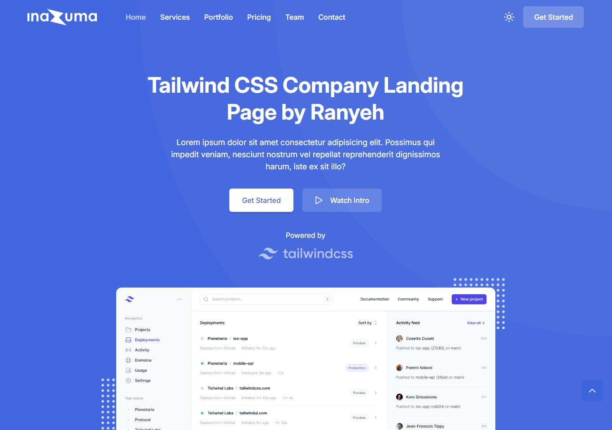

# Inazuma - Tailwind CSS




## Descripción del problema

La señora Lorena Pérez, es dueña de un spa donde ofrece tratamientos faciales y corporales para hombres y mujeres a partir de los 15 años. Aunque tiene presencia en redes sociales como Instagram, Facebook y Google, estas plataformas limitan la cantidad de información que puede compartir sobre los tratamientos y los productos que utiliza, los cuales suelen tener muchos ingredientes activos importantes de explicar. Además, el costo de hacer publicaciones pagadas dificulta aún más la difusión de sus servicios. Lorena no puede detallar su propuesta de valor, brindar información completa y establecer contacto directo con potenciales clientes porque los posts de las redes sociales no le permite escribir tanta información. Esto limita su capacidad de atraer nuevos pacientes que buscan un servicio profesional y confiable en el cuidado estético.

## Features

* Responsive navbar with CTA and dark mode buttons
* Hero section with CTA and intro video buttons
* Contains animations when scrolling
* Smooth scrolling in each section
* Includes a dark & light theme mode
* Responsive footer
* SEO-Friendly
* Compatible to all browsers

## Tecnologías usadas

* HTML
* CSS
* JavaScript
* [Tailwind CSS](https://tailwindcss.com/)

## Plugins Used

* [ScrollReveal](https://scrollrevealjs.org/)
* [GLightbox](https://biati-digital.github.io/glightbox/)
* [Lineicons](https://lineicons.com/)

### Change Colors

1. Open the `tailwind.config.js` file.
2. Go to the `colors` key in the `extend` section under `theme` section.
```javascript
/** @type {import('tailwindcss').Config} */
module.exports = {
  ...
  theme: {
    extend: {
      ...
      colors: {
        // Colors customization here
        // If you want to change key name, make sure you change the class name that used in the HTML file
      },
      ...
    },
  },
  ...
};
```
3. Change the color keys or values you want. To learn more, see the [color customization documentation](https://tailwindcss.com/docs/colors).
4. Save the changes and run it in your web browser.

### Change Font Family

1. Open the `tailwind.config.js` file.
2. Go to the `fontFamily` key in the `extend` section under `theme` section.
```javascript
/** @type {import('tailwindcss').Config} */
module.exports = {
  ...
  theme: {
    extend: {
      ...
      fontFamily: {
        sans: ["Inter", "sans-serif"],  //Sans-serif font
      },
      ...
    },
  },
  ...
};
```
3. Replace `Inter` font name with another font name you want. To learn more, see the [font family customization documentation](https://tailwindcss.com/docs/font-family).
4. Open the `tailwind.css` file.
5. Update the Google Fonts link and change `font-family` property with the font name you want.
```css
@import url(/* Your Google Fonts link here */);
...
@layer base {
  ...
  html {
    ...
    font-family: /* Your font name here */;
  }
  ...
}
```
6. Save the changes and run it in your web browser.

## Bugs and Issues

Have a bug or an issue with this template? [Open a new issue](https://github.com/ranyeh24/inazuma/issues) here on GitHub or email me at <real.ranyeh24@gmail.com>.

## Creditos

* Template design from [Play | Free Tailwind CSS Template for Startup and SaaS By TailGrids](https://play-tailwind.tailgrids.com/)
* Images from [Unsplash](https://unsplash.com/)

## Licencia

Inazuma is open-source and available under the [MIT License](https://raw.githubusercontent.com/ranyeh24/inazuma/main/LICENSE). You can use it with your personal or commercial projects without any attribution or backlink.
